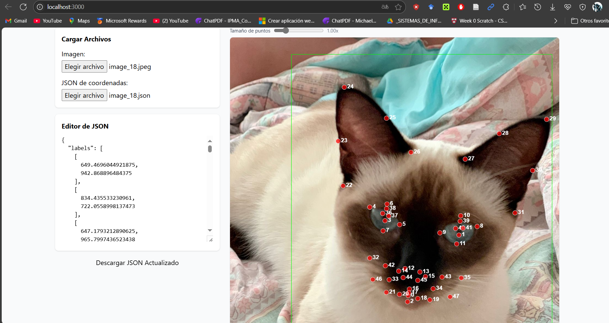

# Interfaz Local

**Interfaz Local** es una herramienta visual para editar y ajustar coordenadas sobre imágenes, ideal para anotaciones, datasets de visión computacional, o cualquier tarea que requiera marcar puntos y cajas delimitadoras sobre imágenes y exportar/importar los datos en formato JSON.

## ¿Qué puedes hacer con esta interfaz?

- **Cargar una imagen** y visualizarla en un canvas interactivo.
- **Importar un archivo JSON** con coordenadas de puntos (`labels`) y cajas delimitadoras (`bounding_boxes`).
- **Editar visualmente** la posición de los puntos arrastrándolos sobre la imagen.
- **Ajustar el tamaño de los puntos** para mayor precisión visual.
- **Editar el JSON directamente** desde un editor de texto integrado.
- **Exportar el JSON actualizado** con las nuevas coordenadas.

## ¿Para quién es útil?

- Equipos de visión computacional y machine learning que preparan datasets.
- Profesionales que necesitan marcar puntos de referencia en imágenes.
- Cualquier persona que requiera una interfaz sencilla para manipular coordenadas gráficas.

## ¿Cómo funciona?

1. **Carga una imagen** (JPG, PNG, etc.).
2. **Carga un archivo JSON** con la estructura:
   ```json
   {
     "labels": [[x1, y1], [x2, y2], ...],
     "bounding_boxes": [x1, y1, x2, y2]
   }
   ```
3. **Ajusta los puntos** arrastrándolos sobre la imagen.
4. **Modifica el JSON** si lo deseas, desde el editor de texto.
5. **Descarga el JSON actualizado** para usarlo en tus proyectos.

## Instalación y uso

1. Clona este repositorio.
2. Instala las dependencias:
   ```bash
   npm install
   ```
3. Inicia la aplicación:
   ```bash
   npm start
   ```
4. Accede a la interfaz en tu navegador y comienza a trabajar con tus imágenes y coordenadas.

## Tecnologías utilizadas

- **React** para la interfaz de usuario.
- **Tailwind CSS** (o similar) para estilos rápidos y modernos.
- **Canvas API** para renderizado y manipulación gráfica.

## Captura de pantalla

 <!-- Puedes agregar una imagen de ejemplo aquí -->

---

¡Haz tus anotaciones de manera visual, rápida y sencilla con **Interfaz Local**!

